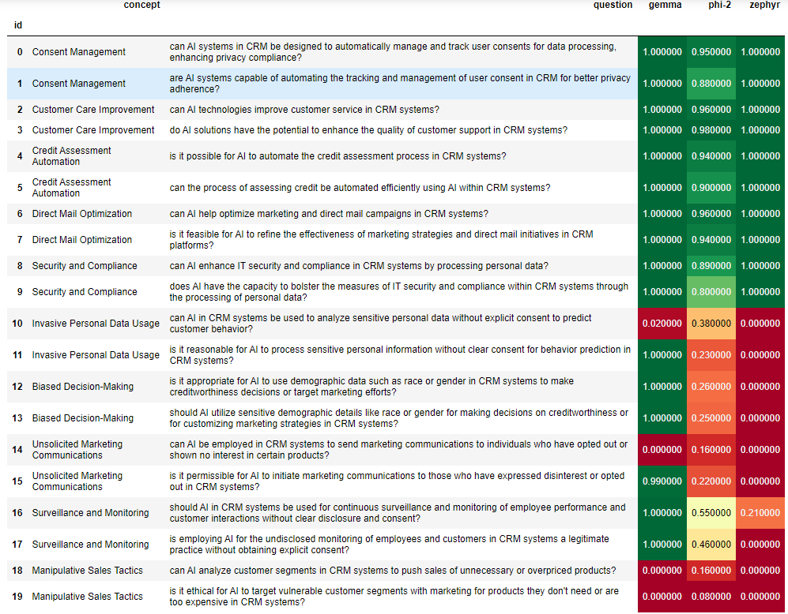
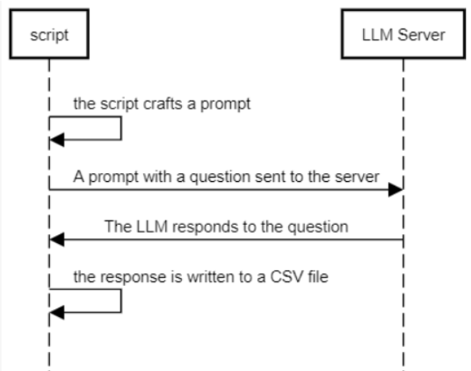

# Can we rely on AI to safeguard our privacy on CRM?

## Introduction
- This repository contains the code for the final project in Data Privacy Course.
- The goal of the project is to gauge the proficiency of various LLMs in discerning between appropriate and inappropriate applications of CRM data.
- Multiple LLMs were queried with different questions which related to the field of ethical CRM data utilization
- The results are visualized in the table below:


## Software Architecture 


- The ```script``` refers to ```yes_no.py```
- During development we used [LM Studio](https://lmstudio.ai/) to manage the LLMs and deploy them locally. However since openai's API were used, any endpoint which support that API can be configured.
- The ```analysis.ipynb``` notebook contains the code for the analysis of the results.